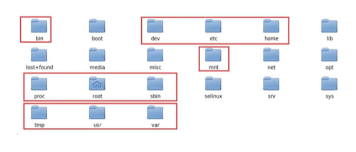
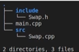
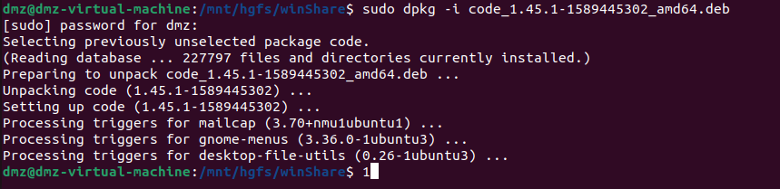
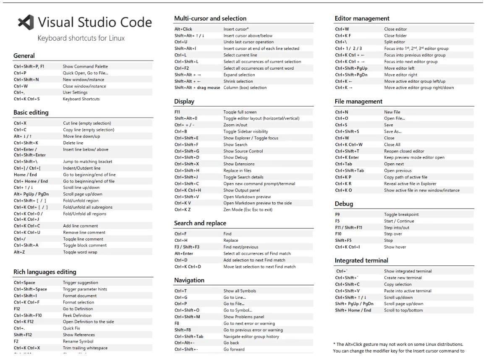
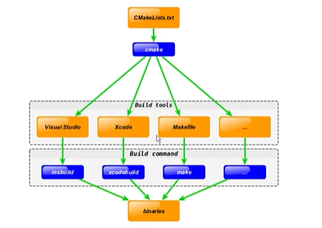
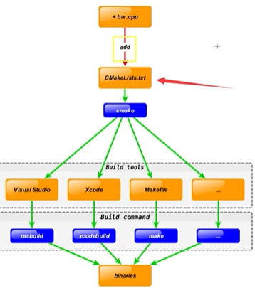

# 第一讲：Linux系统介绍

**什么是linux系统？**

* linux是**开源**的操作系统

**多用户、多任务：**

* 单用户：在登录计算机（操作系统），只能允许同时登录一个用户
* 单任务：允许用户同时进行的操作任务数量
* 多用户：同时允许多个用户登录计算机（操作系统）
* 多任务：允许用户同时进行多个操作系统任务

**Windows：**单用户、多任务

**Linux：**多用户、多任务、一切皆文件

**文件的操作：**创建文件、编辑文件、保存文件、关闭文件、重命名文件、删除文件、恢复文件

## 1.1 目录结构



**目录结构：**

* **Bin：**全称binary，含义是二进制。存储二进制文件，都是可以被运行的
* **Dev：**该目录主要存放外接设备，例如盘、其它光盘等。其中的外接设备是不能直接被使用的，需要挂载（类似windows下的分配盘符）
* **Etc：**主要存储一些配置文件
* **Home：**除了root用户以外其他用户的家目录，类似windows下的User/用户目录
* **Proc:**全称process，表示进程，存储Linux运行时候的进程
* **Root：**表示root用户自己的家目录
* **Sbin：**全称super binary，存储一些可以被执行的二进制文件，但是必须有super权限的用户才能执行
* **Tmp：**当系统运行时候产生的临时文件会在这个目录存着
* **Usr：**存放用户自己安装的软件，类似windows下的program files
* **Var：**存放程序/系统的日志文件
* **Mnt：**外接设备需要挂载的时候，需要挂载到mnt目录下

## 1.2 指令与选项

**指令格式：**

* 命令（空格）[选项] （空格）[对象]
* 选项和对象是可选的

**指令：**

* **pwd**

  * 作用：打印当前终端所在的目录
  * 用法：`pwd`

* **ls**

  * 作用：列出当前工作目录下的所有文件/文件夹的名称
  * 用法1：`ls`
  * 用法2：`ls [路径]`

  ```bash
  ls ./ #表示当前目录
  ls ../ #表示上级目录
  ls /home #绝对路径
  ```

  * 用法3：`ls [选项]`

  ```bash
  ls -lah /home
  # -l 表示以详细列表的形式进行展示
  # -a 表示显示所有的文件/文件夹
  # -h 表示以可读性较高的形式显示
  #在linux中隐藏文件一般以"."开头
  ```

* **cd**

  * 作用：切换当前目录
  * 用法1：`cd` `cd~`两个命令等价，进入当前用户家目录下
  * 用法2：`cd [路径]`

  ```bash
  cd .. #进入到上级目录下
  cd /usr/local #绝对路径
  ```

* **mkdir**

  * 作用：创建目录
  * 用法：`mkdir [选项] [路径]`

  `````bash
  mkdir myfolder
  mkdir -p ~/a/b/c #一次性创建多层不存在的目录
  mkdir a b c #分别创建a、b、c三个文件夹
  `````

* **touch**

  * 作用：创建新文件
  * 用法：`touch [路径]`

  ```bash
  touch linux.txt #在当前目录下创建linux.txt文件
  touch file file.txt #在当前目录下创建file file.txt两个文件
  ```

* **rm**

  * 作用：删除文件/目录
  * 用法：`rm [选项] 需要移除的文件路径`

  `````bash
  rm /usr/file01 #删除文件
  rm -rf /usr #递归删除包含usr目录在内的所有下层文件
  `````

* **cp**

  * 作用：复制文件/文件夹到指定位置
  * 用法1：`cp [被复制的文件路径] [文件被复制到的路径]`

  `````bash
  cp /home/bing/myfile ./
  `````

  * 用法2：`cp -r [被复制的文件路径] [文件被复制到的路径] `

  ```bash
  cp -r /home/bing/myfolder /
  ```

* **mv**

  * 作用：移动文件到新的位置或者**重命名文件**
  * 用法：`mv [需要移动的文件路径] [需要保存的文件路径]`

  ```bash
  mv myfile /myfile
  mv myfolder /myfolder
  mv myfile myfile007 #重命名
  ```

* **man**

  * 作用：包含了linux中全部命令手册
  * 用法：`man [命令]`

* **reboot**

  * 作用：重启linux系统
  * 用法：`reboot`

* **shutdown**

  * 作用：关机
  * 用法：`shut -h [时间]`

  ```bash
  shut -h now
  ```

## 1.3 文件编辑

**Vim [file]**

* 所有的linux系统都会内建Vim编辑器
* Vim具有程序开发能力，也可以用来对文件进行简单的编辑
* 编辑器之神

**gedit [file]**

* linux下的纯文本编辑器
* 根据不同的语言高亮显示关键字和标识符

**nano [file]**

* 小巧的文本编辑器
* 适合初学者使用

# 第二讲：开发环境搭建

## 2.1 编译器、调试器安装

**安装GCC，GDB**

```bash
sudo apt update
sudo apt install build-essential gdb
```

**安装成功确认**

```bash
gcc --version
g++ --version
gdb --version
#如果成功，则显示版本号
```

## 2.2 CMake安装

**安装cmake**

```bash
sudo apt install cmake
```

**安装成功确认**

```bash
cmake --version
```

# 第三讲：GCC编译器

## 3.1 编译过程

**1.预处理 Pre-Processing	//.i文件**

```bash
#-E选项指示编译器仅对输入文件进行预处理
g++ -E test.cpp -o test.i
```

**2.编译 Compiling	//.s文件**

```bash
#-S选项告诉g++在为C++代码产生了汇编语言文件后停止编译
g++ -S test.i -o test.s
```

**3.汇编 Assembling    //.o文件**

```bash
#-c选项告诉g++仅把源代码编译为机器语言的目标代码
g++ -c test.s -o test.o
```

**4.链接 Linking   //bin文件**

```bash
#-o选项来为产生的可执行文件用指定的文件名
g++ test.o -o test
```

**5.上述五步汇总**

```bash
g++ test.cpp -o test
./test #运行
```

## 3.2 g++重要编译参数

**1.-g 编译带调试信息的可执行文件**

```bash
#-g选项告诉GCC产生能被GNU调试器GDB使用的调试信息，以调试程序
g++ -g test.cpp
```

**2.-O[n]    优化源代码**

```bash
# 所谓优化，例如省略掉代码中从未使用的变量、直接将常量表达式用结果值替代等等，这些操作会缩减目标文件所包含的代码量，提高最终生成的可执行文件的运行效率

# -O选项告诉g++对源代码进行基本优化，这些优化大多情况下都会使程序执行得更快
# -O2选项告诉g++产生尽可能小和尽可能快的代码：
# -O 同时减小代码的长度和执行时间，效果等价于-O1
# -O0表示不做优化
# -O1 默认优化
# -O2 除了完成-O1优化之外，还进行一些额外的调整工作，如指令调整等
# -O3 包括循环展开和其它一些与处理特性相关的优化工作
# 选项将使编译的速度比使用-O时慢，但通常产生的代码执行速度会更快

g++ -O2 test.cpp
#linux可以通过time指令记录执行时间，如：time ./test
```

**3. -l / -L 指定库文件/指定库文件路径**

```bash
# -l参数就是用来指定程序要链接的库，-l参数紧接着就是库名
# 在/lib和/usr/lib和/usr/local/lib里的库直接用-l参数就能链接
# 链接glog库
g++ -lglog test.cpp
#如果库文件没放在上面三个目录里，需要使用-L指定库文件所在目录
g++ -L/home/bing/mytestlibfolder -lmytest test.cpp
```

**4. -I 指定头文件搜索目录**

```bash
# /usr/include目录一般不用指定，gcc知道哪里去找，但如果头文件不在/usr/include中，就需要用-I参数指定，可以使用相对路径
g++ -I/myinclude
```

**5. -Wall 打印警告信息**

```bash
g++ -Wall test.cpp
```

**6. -w 关闭警告信息**

```bash
g++ -w test.cpp
```

**7. -std=c++11 设置编译标准**

```bash
g++ -std=c++11 test.cpp
```

**8. -o 指定输出文件名**

```bash
g++ test.cpp -o test
```

**9. -D 定义宏**

```c
//在使用gcc/g++编译的时候定义宏
//常用场景：
//-DDEBUG 定义宏，可能文件中有DEBUG宏部分的相关信息，可以通过DDEBUG来选择开启DEBUG
#include<stdio.h>
int main()
{
    #ifdef DEBUG
    	printf("DEBUG LOG\n");
    #endif
    	printf("in\n");
}
//在编译的使用可以用：gcc -DDEBUG main.cpp 则第8行代码可以被执行
```

## 3.3 g++命令行编译（实战）

**案例：**目录结构如下所示



### 3.3.1直接编译

```bash
g++ main.cpp src/Swap.cpp -Iinclude
./a.out
```

或者可以多带一些参数

```bash
g++ main.cpp src/Swap.cpp -Iinclude -std=c++11 -O2 -Wall -o b.out
./b.out
```

### 3.3.2 生成文件库编译

> 什么是库？库是写好的，现有的，成熟的，可以复用的代码。现实中每个程序都要依赖很多基础的底层库，不可能每个人的代码都从零开始，因此库的存在意义非同寻常
>
> 本质上来说，库是一种可执行代码的二进制形式，可以被操作系统载入内存执行。库有两种：静态库（.a、.lib）和动态库（.so、.dll）
>
> 静态库：在链接阶段，会将汇编生成的目标文件.o与引用的库一起链接打包到可执行文件中，对应的方式叫做静态链接，静态库和.o文件格式相似，可以看成一组.o文件的集合，即很多目标文件经过压缩打包后形成的一个文件
>
> 静态库特点如下：
>
> 1.程序在运行时与函数库再无瓜葛，移植方便
>
> 2.浪费空间与资源，因为所有相关的目标文件与牵涉到的函数库被链接成一个可执行文件
>
> 静态库存在两个问题：
>
> 1.空间浪费，例如静态库占用1M内存，如果有2000个程序要使用这个静态库，则此静态库要在空间中存在多份拷贝，导致空间浪费
>
> 2.静态库对程序的更新、部署带来麻烦，如果静态库libxx.lib更新了，所有使用它的应用程序都需要重新编译、发布给用户
>
> 动态库：在程序编译时并不会被连接到目标代码中，而是在程序运行是才被载入。不同的应用程序如果调用相同的库，那么在内存里只需要有一份该共享库的实例，规避了空间浪费问题。动态库在程序运行时才被载入，也解决了静态库对程序的更新、部署和发布页会带来麻烦。用户只需要更新动态库即可.

链接**静态库**生成可执行文件：

```bash
#进入src下
$cd src
g++ Swap.cpp -c -I../include
ar rs libSwap.a Swap.o#创建静态库
$cd ..
g++ main.cpp -Iinclude -Lsrc -lSwap -o staticmain 
#Linux下使用静态库，只需要在编译的时候，指定静态库的搜索路径（-L选项）、指定静态库名（不需要lib前缀和.a后缀，-l选项）
```

链接**动态库**生成可执行文件：

```bash
$cd src
g++ Swap.cpp -I../include -fPIC -shared -o libSwap.so
#等价于：gcc Swap.cpp -I../include -c -fPIC 
#gcc -shared -o libSwap.so Swap.o
#-fPIC告诉编译器生成位置独立的代码，知识创建共享库所必须的
$cd ..
g++ main.cpp -Iinclude -Lsrc -lSwap -o shareman
```

### 3.3.3 运行可执行文件

```bash
#运行可执行文件（静态库）
./staticmain
#运行可执行文件（动态库）
LD_LIBRARY_PATH=src 
./sharemain
```

# 第四讲：GDB调试器

**前言：**

* GDB(DNU Debugger)是一个用来调试C/C++程序的功能强大的调试器，是Linux系统开发C/C++最常用的调试器
* 可以使用GDB来跟踪程序错误，减少程序员工作量
* VSCode通过GDB调用实现C/C++调试工作

**GDB主要功能：**

* 设置断点
* 单步执行程序
* 查看变量值变化
* 动态改变程序运行环境
* 分析崩溃程序产生的core文件

## 4.1 常用调试命令参数

调试开始：执行`gdb [exefilename]` 进入调试程序

```bash
#以下命令括号为简化使用
$(gdb)help(h) #查看命令帮助 help+命令
$(gdb)run(r) #重新开始运行文件
$(gdb)start #单步执行
$(gdb)list(l)#查看源码（list-n：从第n行开始看代码 list+函数名：查看具体函数）
$(gdb)set #设置变量的值
$(gdb)next(n) #单步调试（跳过函数）
$(gdb)step(n) #单步调试（跳入函数内部）
$(gdb)backtrace(bt) #查看函数的调用的栈帧和层级关系
$(gdb)frame(f) #切换函数栈帧
$(gdb)info(i) #查看变量值
$(gdb)finish #结束当前函数
$(gdb)continue(c) #继续运行
$(gdb)print(p) #打印值及地址
$(gdb)quit(q) #退出gdb
$(gdb)break+num(b) #在第num行设置断点
$(gdb)info breakpoints/watch #查看当前设置的所有断点/监视点
$(gdb)delete breakpoints num(d) #删除第num个断点
$(gdb)display/undisplay #追踪/取消查看具体变量的值
$(gdb)watch #设置监视点
$(gdb)enable/disable breakpoints #启用/禁用断点
```

>编译程序时需要加-g才能用gdb调试： gcc -g main.c -o main

# 第五讲：IDE-VSCode

## 5.1 界面介绍

**在Ubuntu中下载VSCode：**

* 方法一：使用Ubuntu自带的应用中心直接安装（不推荐，因为这种方式下载的版本是删减版，可能会有功能的缺失！）
* 方法二：自己在网上下载deb包，地址：https://code.visualstudio.com/docs?dv=linux64百度网盘链接：https://pan.baidu.com/s/1HKBQ6k9X-ZVX4C2vYgBFSA 提取码：7ze2（感谢csdn博主：“[LL596214569](https://blog.csdn.net/LL596214569)”提供的deb包）然后再终端直接输入以下代码：

```bash
sudo dpkg -i [deb文件名]
```

如果出现下图，则说明安装成功：



具体的界面介绍暂略

## 5.2 插件安装

以下三款插件式在Linux下CMake开发C/C++的三款必备插件：

* C/C++
* CMake
* CMake Tools

## 5.3 快捷键

**官方快捷键总表**



**常用快捷键总结**

| 功能                  | 快捷键       | 功能            | 快捷键      |
| --------------------- | ------------ | --------------- | ----------- |
| 转到文件/其它常用操作 | ctrl+P       | 关闭当前文件    | ctrl+W      |
| 打开命令面板          | ctrl+shift+P | 当前行上移/下移 | Alt+up/down |
| 打开终端              | ctrl+`       | 变量统一重命名  | F2          |
| 关闭侧边栏            | ctrl+B       | 转到定义处      | F12         |
| 复制文本              | ctrl+C       | 粘贴文本        | ctrl+V      |
| 保存文件              | ctrl+S       | 撤销操作        | ctrl+Z      |

## 5.4 两个小项目

通过手写2个小项目，呈现出基本的C++工程建立过程，并编译运行这两个小项目（源代码已经放入相关文件夹中）

* 项目一：Hello World（project1）

  包含：helloworld.cpp

* 项目二：Swap with class（project2）

  包含：include/swap.h    src/swap.c    main.c

### 5.4.1 高频使用技巧

* 左右分屏（split right）
* 固定打开文件
* 格式化代码（ctrl shift I）
* Rename Symbol（F2）
* 显示minimap
* 侧边栏查看OUTLINE
* 全屏（F11）
* 关闭多个打开的文件

### 5.4.2 代码编写

### 5.4.3 编译并运行

# 第六讲：CMake

**前言：**

* CMake是一个跨平台的安装编译工具，可以用简单的语句来描述所有平台的安装（编译过程）
* CMake可以说已经成为大部分C++开源项目标配

## 6.1 Cross-platform development

 如果没有实现跨平台的功能，此时想要在项目当中添加一个cpp文件，就会十分麻烦，如下所示：


如果使用了CMake去构建工程：



此时想要去增加一个文件：



## 6.2 语法特性介绍

* 基本语法格式：指令（参数1，参数2...)
  * 参数使用括弧括起来
  * 参数之间使用空格或分号分开
* 指令是大小写无关的，参数和变量是大小写相关的

```bash
set(HELLO hello.cpp)
add_executable(hello main.cpp hello.cpp)
ADD_EXECUTABLE(hello main.cpp ${HELLO})
```

* 变量使用${}方式取值，但是在IF控制语句中是直接使用变量名

## 6.3 重要指令和CMake常用变量

### 6.3.1 重要指令

**cmake_minimum_required 指定CMake的最小版本要求**

```cmake
cmake_minimum_required(VERSION 2.8.3)
```

**project 定义工程名称，并指定工程支持的语言**

```cmake
#语法：project(projectname [CXX][C][Java])
project(HELLOWORLD)
```

**set 显示定义变量**

```cmake
set(SRC sayhello.cpp hello.cpp)
```

**include_directories 向工程添加多个特定的头文件的搜索路径**

```cmake
#将/usr/include/myincludefolder 和 ./include 添加到头文件搜索路径
include_directories(/usr/include/myincludefolder ./include)
```

**include_directories 向工程添加多个特定库文件搜索路径**

```cmake
link_directories(/usr/lib/mylibfolder ./lib)
```

**add_library 生成库文件**

```cmake
#语法：add_library(libname[SHARED|STATIC|MODULE][EXCLUDE_FROM_ALL] source1 source2 ... sourceN)
#通过变量SRC生成libhello.so共享库
add_library(hello SHARED ${SRC})
```

**add_compile_options 添加编译参数**

```cmake
add_compile_options(-wall -std=c++11 -o2)
```

**add_executable 生成可执行文件**

```cmake
#编译main.cpp生成可执行文件main
add_executable(main main.cpp)
```

**target_link_libraries 为target添加需要链接的共享库** 相当于g++的-l参数

```cmake
#将hello动态库文件链接到可执行文件main
target_link_libraries(main hello)
```

**add_subdirectory 向当前工程添加存放源文件的子目录，并可以指定中间二进制和目标二进制存放位置**

```cmake
#添加src子目录，src中需要有一个CMakeList.txt
add_subdirectory(src)
```

**aux_source_directory 发现一个目录下所有的源代码文件并将列表存储在一个变量中，这个指令临时使用来自动构建源文件列表**

```cmake
#定义SRC变量，其值为当前目录下所有的源代码文件
aux_source_directory(. SRC)
#编译SRC变量所代表的源代码文件，并生成main可执行文件
add_executable(main ${SRC})
```

### 6.3.2 CMake常用变量

* **CMAKE_C_FLAGS    gcc编译选项**
* **CMAKE_CXX_FLAGS    g++编译选项**

```cmake
set(CMAKE_CXX_FLAGS "${CMAKE_CXX_FLAGS} -std=c++11")
```

* **CMAKE_BUILD_TYPE    编译类型（Debug，Release）**

```cmake
set(CMAKE_BUILD_TYPE Debug)
```

* **CMAKE_BINARY_DIR**
* **PROJECT_BINARY_DIR**
* <projectname>**_BINARY_DIR**

>这三个变量指代的内容一致

* **CMAKE_C_COMPILER:指定C编译器**
* **CMAKE_CXX_COMPILER:指定C++编译器**
* **EXECUTABLE_OUTPUT_PATH:可执行文件输出的存放路径**
* **LIBRARY_OUTPUT_PATH:库文件输出的存放路径**

## 6.4 CMake编译工程

CMake目录结构：项目主目录存在一个CMakeLists.txt文件

**两种方式设置编译规则：**

1.包含源文件的子文件夹包含CMakeLists.txt文件，主目录的CMakeLists.txt通过add_subdirectory添加子目录即可

2.包含源文件的子文件夹未包含CMakeLists.txt文件，子目录编译规则体现在主目录的CMakeList.txt中

### 6.4.1 编译流程

**在Linux平台下使用CMake构建C/C++工程的流程如下：**

1.手动编写CMakeLists.txt
2.执行命令cmake PATH 生成Makefile（PATH是顶层CMakeLists.txt所在的目录）
3.执行命令make进行编译

### 6.4.2 两种构建方式

1.内部构建（in-source build）不推荐使用

  内部构建会在同级目录下产生一大堆中间文件，这些中间文件并不是我们最终所需要的，和工程源文件放在一起会显得杂乱无章

  ```cmake
  #在当前目录下，编译本目录的CMakeLists.txt生成Makefile和其他文件
  cmake .
  #执行make命令，生成target
  make
  ```

2.外部构建（out-of-source build）**推荐使用**

  将编译输出文件与源文件放到不同目录中

  `````cmake
  #1.在当前目录下，创建build文件夹
  mkdir build
  #2.进入build文件夹
  cd build
  #3.编译上级目录的CMakeLists.txt，生成Makefile和其他文件
  cmake ..
  #4.执行make命令，生成target
  make
  `````

  ## 6.5 【实战】CMake代码实践

  ### 6.5.1 最小CMake工程

  对于上面5.4的那个project1，在同级目录下新建文件CMakeList.txt：

  ```cmake
  cmake_minimum_required(VERSION 3.0)
  
  project(HELLOWORLD)
  
  add_executable(helloWorld_cmake helloworld.cpp)
  ```

  然后先尝试内部编译，在终端输入`cmake .`此时会产生很多文件，再输入`make`即可生成可执行文件helloWorld_cmake

  再尝试外部编译，具体方法可以直接看6.4.2

  ### 6.5.2 编译多个文件

  对于上面5.4的那个project2，在同级目录下新建文件CMakeList.txt：

  ```cmake
  cmake_minimum_required(VERSION 3.0)
  
  project(SWAP)
  
  include_directories(include)
  
  add_executable(main_camke main.cpp src/swap.cpp)
  ```

  然后使用上述同样的思路进行外部or内部编译

  # 第七讲：使用VSCode进行完整项目开发

  ## 7.1 项目过程

  这个项目在project2的基础上做了一些小的拓展，就不专门将项目代码放入文件夹中，而是全部放在笔记中

  **案例：士兵有一把枪，他可以进行换子弹、开枪这两个操作，分别编写枪类和士兵类**

  **项目目录包含：**

  * include文件夹放置头文件
  * src文件夹放置类源码
  * build文件夹
  * .vscode文件夹放置调试的json文件
  * main.cpp

**include文件夹**

```c
//Gun.h
#pragma once
#include<string>
class Gun
{
 public:
    Gun(std::string type){
        this->bullet_count = 0;
        this->type = type;
    }
    
    void addBullet(int bullet_num);
    bool shoot();
 private:
    int _bullet_count;
    std::string _type;
};

//Soldier.h
#pragma once
#include<string>
#include "include/Gun.h"
class Soldier
{
public:
    Soldier(std::string name);
    void addGun();
    void addBulletToGun(int num);
    bool fire();
private:
    std::string _name;
    Gun * _ptr_gun;
};
```

**src文件夹**

```cpp
#Gun.cpp
#include "include/Gun.h"
#include <iostream>
using namespace std;
void Gun::addBullet(int bullet_num)
{
    this->_bullet_count += bullet_num;
}

bool Gun::shoot()
{
    if(this->_bullet_count <= 0)
    {
        cout<<"no bullet"<<endl;
        return false;
    }
    this->_bullet_count -= 1;
    cout<<"shoot successfully"<<endl;
    return true;
}

#Soldier.cpp
#include "include/Soldier.h"
#include<iostream>
using namespace std;

Soldier::Soldier(string name)
{
    this->_name = name;
    this->_ptr_gun = nullptr;
}

void Soldier::addGun(Gun * ptr_gun)
{
    this->_ptr_gun = ptr_gun;
}

void Soldier::addBulletToGun(int num)
{
    this->_ptr_gun->addBullet(num);
}

bool Soldier::fire()
{
    this->_ptr_gun->shoot();
}

Soldier::~Soldier()
{
    if(this->_ptr_gun==nullptr)
    {
        return;
    }
    delete this->_ptr_gun;
    this->_ptr_gun = nullptr;
}
```

**main.cpp**

```cpp
#include "include/Soldier.h"
#include "include/Gun.h"
void test()
{
    Soldier xusanduo("xusanduo");
    xusanduo.addGun(new Gun("AK47"));
    xusanduo.addBulletToGun(20);
    xusanduo.fire();
}
int main(int argc,char **argv)
{
    test();
    return 0;
}
```

**CMakeLists.txt**

```cmake
cmake_minimum_required(VERSION 3.0)

project(SOLDIERFIRE)

set(CMAKE_CXX_FLAGS "${CMAKE_CXX_FLAGS} -g -O2 -Wall")

include_directories(${CMAKE_SOURCE_DIR}/include)

add_executable(my_cmake_exe main.cpp src/Gun.cpp src/Soldier.cpp)

set(CMAKE_BUILD_TYPE Debug)
```


## 7.2 配置json文件并调试项目

点击"create a launch.json File"选择"C++ (GDB/LLDB)"再选择"g++生成和调试活动文件"

在生成的launch.json中：

```json
"program":"${fileDirname}/${fileBasenameNoExtension}"
//将上述改成：
"${workspaceFolder}/build/my_cmake_exe"
//其中"cwd":"${workspaceFolder}"
```

然后进入build文件夹，重新make一下，然后进入main.cpp在main函数中的`test()`所在行打一个断点，按F5开始调试（如果调试失败可以把CMakeLists.txt中的-g和-O2选项去掉，再加一行`set(CMAKE_BUILD_TYPE Debug)`

此时，如果在main.cpp中增加一行代码，必须要对整个项目重新编译才能再次调试，如果想要实现自动调试，首先在.vscode添加一个tasks.json内容可以复制下面的代码：

```json
{
    "version": "2.0.0",
    "options": {
        "cwd": "${workspaceFolder}/build"
    },
    "tasks": [
        {
            "type": "shell",
            "label": "cmake",
            "command": "cmake",
            "args": [ 
                ".."
            ]
                
        },
        {
            "label": "make",
            "group": {
                "kind": "build",
                "isDefault": true
            },
            "command": "make",
            "args": [ 

            ]
        },
        {
            "label": "Build",
            "dependsOrder": "sequence",
            "dependsOn": [ 
                "cmake",
                "make"
            ]
        }
    ],
}
```

然后再在launch.json中做如下修改：

```json
"preLaunchTask":"Build"
```

此时只需要设置断点、输入F5就可以自动进行重编译并开始调试


  
